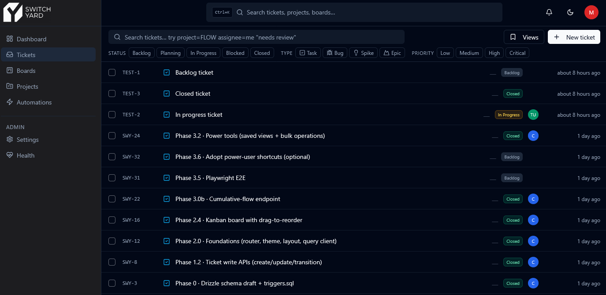
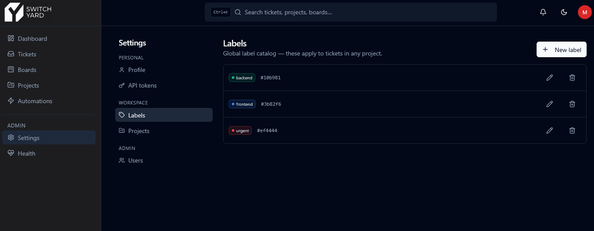
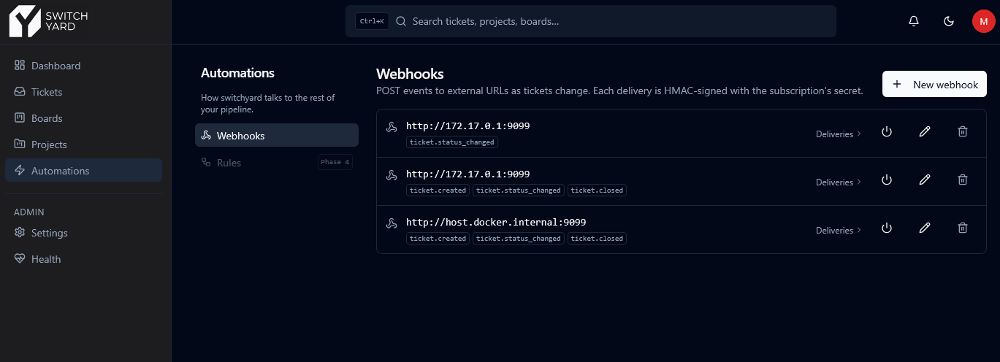
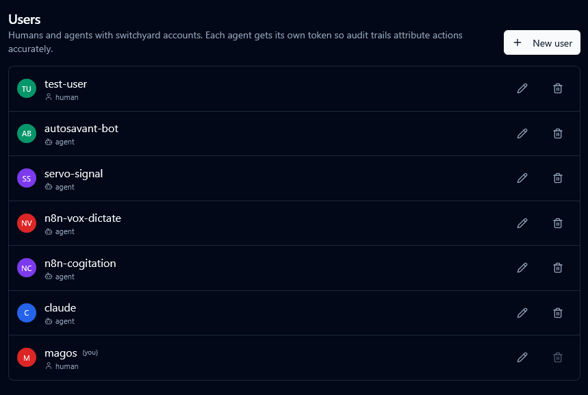
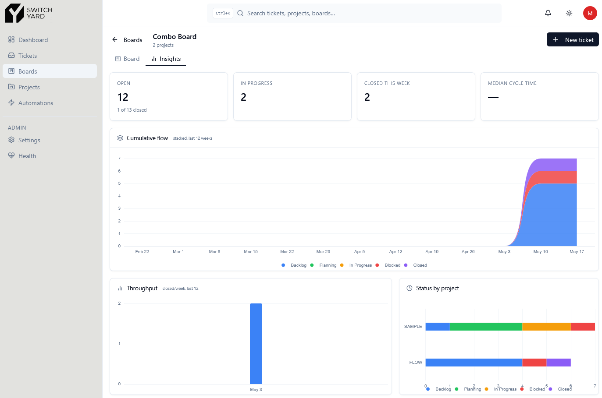
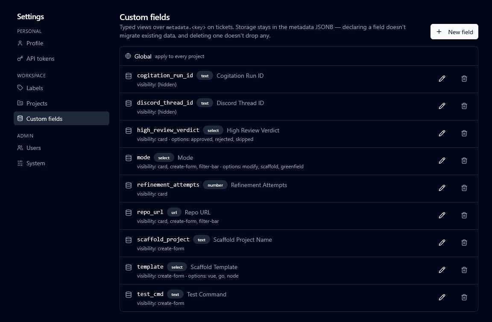
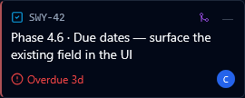
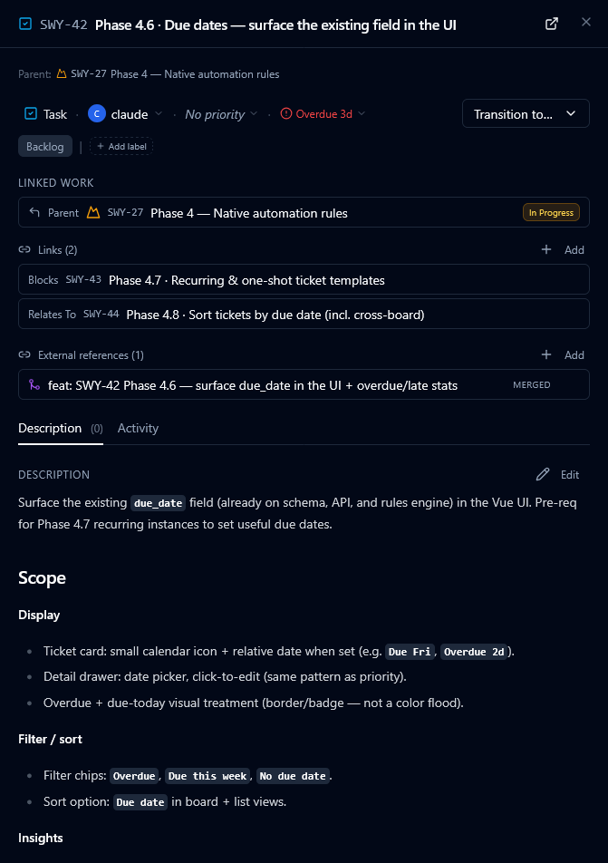

Self-hosted ticketing / project-management system. **API-first, agent-first** — every mutation the UI exposes is equally available via the REST API, making the same codebase useful to both a human clicking through a dashboard and an autonomous agent driving CI or workflow automation.

The human sees a UI. The agents see a clean, typed, idempotent HTTP API with cursor pagination, HMAC-signed webhooks, and structured error envelopes. Both are first-class citizens.


## Stack

- **Server:** Hono on Bun, Drizzle ORM, Zod schemas (single source of truth for validation + OpenAPI + shared types).
- **Client:** Vue 3 + Vite + TypeScript + Tailwind + shadcn-vue + Pinia + TanStack Query.
- **Database:** PostgreSQL 16 (shared instance on `construct_net`).
- **Deploy:** Two containers — Hono serves the API at `/v1/*`; a Bun static server handles the built Vue client and passthroughs `/v1/*` and `/healthz` to the backend.

## What's shipped

Phases 1–4 are complete and Phase 5.0 (switchyard MCP server) has landed; remaining Phase 5 milestones (observability, plugin contract, Cline integration spike) are the next chunk. See [`PHASES.md`](./PHASES.md) for the full plan and architectural decisions.

### Phase 1 — Backend API

Full CRUD on every resource: projects, statuses, transitions, labels, users, tokens, tickets, comments, attachments, boards, and webhooks. Cursor pagination on every list endpoint. Idempotency keys on every mutation (24h TTL). HMAC-signed outbound webhooks with exponential backoff, delivery log, and redeliver endpoint. Event sourcing — every mutation writes to `events` and enqueues webhook deliveries in the same transaction. Structured JSON access logs; `/healthz` subsystem report; graceful 10s drain on shutdown.

Notable rules enforced server-side:
- `/transition` is the only path to change ticket status — `PATCH` explicitly omits `status_id`.
- Transitions table is an optional whitelist: zero rows = any-to-any; any rows = enforcement.
- `resolution` is required when the target status category is `closed`.
- Epic-close guard refuses to close an epic with open child tickets.

### Phase 2 — Frontend

Full UI parity with the API. Everything you can do via `curl`, you can do in the browser.

**Ticket list** — virtualized table with URL-driven filter state, DSL search (`project=FLOW assignee=me status=in_progress,blocked`), saved views, and multi-select bulk operations.



**Kanban board** — drag-and-drop via `pragmatic-drag-and-drop`; per-column virtualization; drop-to-closed column prompts for resolution. Single-project boards at `/projects/:key/board` and saved cross-project boards with optional swimlanes (group by project / assignee / epic / type).


**Settings** — profile, API tokens, global label catalog, project statuses + transitions, webhook subscriptions + delivery logs.



**Webhooks** — HMAC-signed POST subscriptions wired to your external pipeline. Delivery log and redeliver on failure.



**Actor model** — humans and agents share the same `users` table; every API token is owned by a named user so audit trails are clean and attributable.



Keyboard shortcuts (`g t` tickets, `g b` boards, `c` new ticket, `?` shortcut sheet), command palette (`Ctrl+K`), light/dark theme toggle, skeleton loaders on every surface.

### Phase 3 — Dashboards, power tools, and notifications

**Personal dashboard** — KPI strip (open tickets / in-progress + stale count / closed this week with sparkline / median cycle time), throughput bar chart, status-distribution donut, recent activity feed, @mention panel.

**Per-project Insights tab** — throughput (weekly, last 12 weeks), status distribution donut, cycle time (median + P90 + P95 + per-type breakdown), assignee leaderboard.


**Per-board Insights tab** — cumulative flow stacked area chart, throughput aggregated across the board's projects, status-by-project breakdown bar.



**Saved views** — named filters with project/user/global scope; accessible via the Views menu or the command palette.

**Bulk operations** — multi-select via checkbox + shift-click range; bulk assign, relabel, and transition with confirmation toasts.

**Notifications** — persistent @mention detection on comments and descriptions; unread badge in topbar; mark-as-read; notification dropdown.

**Playwright E2E** — smoke, filter DSL + saved views, bulk ops, board drag, and dashboard tests; GitHub Actions workflow with HTML artifact upload on failure.

**Health page** — live `/healthz` subsystem probe surfaced in the admin sidebar: DB latency, uploads writability, webhook queue depth.


### Phase 4 — Automation, integration, and deadlines

Switchyard graduates from "task tracker with an API" to "orchestration substrate for agentic pipelines." Phase 4 ships the rules engine, named outbound targets, typed cross-ticket links, GitHub external references with state polling and webhook auto-attach, per-project custom fields, and first-class due dates.

**Automation rules** — event-triggered (`ticket.created`, `status_changed`, `commented`, etc.) or cron-scheduled. Match a target query (project / status / type / label / assignee / metadata), apply actions (set field, add label, comment, transition, fire webhook, call n8n). Per-rule rate limit + global circuit breaker. Firings log with retry surface for visibility.

**Targets** — named webhook destinations referenced by name from rules and webhook subscriptions. Swapping a host or rotating a secret is one edit instead of N. Optional per-target HMAC secret and custom headers; revealed once on creation.


**Custom fields** — typed views over the ticket `metadata` JSONB. Define a field once (text / select / number / url, plus visibility hints), and it shows up wherever it's flagged: card, drawer, create-form, filter bar. Storage stays in JSONB so declaring a field doesn't migrate existing data and deleting one doesn't drop any.



**Typed ticket links** — `blocks` / `relates_to` / `duplicates`, surfaced inline on each ticket's drawer. Reverse direction shown automatically (SWY-43 says "Blocked by SWY-42" without a second row).

**External references** — attach GitHub PR / issue / commit / Actions URLs to a ticket. Background poller hydrates titles + state (open / merged / closed / success / failed) and emits `ticket.external_ref_state_changed` events so automations can react. Manual attach + auto-attach via the GitHub webhook receiver (see below).

**GitHub webhook receiver** — `POST /v1/external/github` accepts `pull_request` events, HMAC-verified via `GITHUB_WEBHOOK_SECRET`. The handler parses ticket keys out of the PR title AND branch name (`KEY-N`), wildcard or strict prefix configurable via `EXTERNAL_REF_KEY_PREFIX`, and attaches the PR as an external ref on every matched ticket. State transitions (open → merged / closed) flow through as live updates without polling. Exposed via Tailscale Funnel in the construct-server deployment so GitHub can reach a tailnet-only backend.

**Due dates** — the `due_date` field has been on the schema since Phase 1 but was invisible until now. Surface in the drawer (popover + native date input, anchored to local midnight), on board cards (calendar icon + relative date, red left stripe when overdue), on list rows (column + overdue accent), and in the activity feed as readable dates. Filter chips: Overdue, Due this week, No due date. Project Insights gains two tiles: **Overdue** (open, past due — live snapshot) and **Completed late** (closed tickets that shipped after their due date — all-time count). Overdue / completed-late are deliberately separate metrics — one is current load, the other is historical health.





## Layout

```
switchyard/
├── server/             Hono + Drizzle backend
├── client/             Vue 3 frontend
├── shared/             Zod schemas + derived TS types (consumed by both)
├── compose-changes/    Proposed diffs for ~/construct-server
├── server/Dockerfile   Backend image (API only)
├── client/Dockerfile   Frontend image (static + SPA fallback + /v1/* passthrough)
└── openapi.yaml        Generated from server route definitions
```

## Development

```bash
bun install
bun run typecheck       # tsc -b shared server client (composite project)
bun run db:generate     # generate Drizzle migrations from schema changes
bun run db:migrate      # apply migrations + triggers + seed to $DATABASE_URL
bun run dev:server      # API on :4002
bun run dev:client      # Vite dev server on :5173, proxies /v1 to :4002
bun run openapi:gen     # writes openapi.yaml from the live route registry
bun run api:gen         # also regenerates client/src/lib/api.types.ts (committed)
```

Tests:

```bash
# One-time: create the test DB (see compose-changes/README.md) then:
bun --cwd server run db:test:setup
bun --cwd server run test:unit         # pure helpers (pagination, hmac)
bun --cwd server run test:integration  # seed + webhook end-to-end (needs DATABASE_URL_TEST)

# E2E (Playwright, requires dev server running):
bun --cwd client run test:e2e
bun --cwd client run test:e2e:ui       # interactive Playwright UI
```

## How agents use this API

### Authentication

Every `/v1/*` request needs a bearer token. Tokens belong to a user (`POST /v1/users/{id}/tokens`); the plaintext is returned **once** at creation. Store it in n8n credentials, the agent's env, etc., and never log it.

```bash
curl -H "Authorization: Bearer sw_..." http://switchyard:4002/v1/users/me
```

### Idempotency

Every POST/PATCH/DELETE accepts an `Idempotency-Key` header. Replays within 24h return the original cached response (status + body) — agents can retry safely without creating duplicates.

```bash
KEY=$(uuidgen)
curl -X POST -H "Authorization: Bearer $TOK" -H "Idempotency-Key: $KEY" \
  -H 'Content-Type: application/json' \
  http://switchyard:4002/v1/tickets \
  -d '{"project_key":"FLOW","type":"task","title":"automated ticket"}'
# Repeating the call with the same KEY returns the same ticket — not a 409.
```

### Cursor pagination

List endpoints return:

```json
{
  "items": [ /* ... */ ],
  "page": { "next_cursor": "eyJ1Ijoi...", "has_more": true }
}
```

Pass `next_cursor` back in `?cursor=...` to fetch the next page. Treat it as opaque — the format is `(updated_at, id)` pairs encoded base64url, but it can change.

### Error envelope

Non-2xx responses always look like:

```json
{ "error": { "code": "unprocessable", "message": "...", "details": { /* optional */ } } }
```

Codes: `bad_request | unauthorized | forbidden | not_found | conflict | unprocessable | rate_limited | internal | service_unavailable`. Parse `code`, surface `message`.

### Webhook signature verification

Outbound webhooks include `X-Switchyard-Signature: sha256=<hex>` — the HMAC-SHA256 of the request body using the subscription's secret. Verify before trusting the payload.

**Node.js:**

```js
import { createHmac, timingSafeEqual } from "node:crypto";

function verify(secret, rawBody, headerValue) {
  const expected = createHmac("sha256", secret).update(rawBody).digest("hex");
  const sig = (headerValue ?? "").replace(/^sha256=/, "");
  const a = Buffer.from(expected, "hex");
  const b = Buffer.from(sig, "hex");
  return a.length === b.length && timingSafeEqual(a, b);
}
```

**Python:**

```python
import hmac, hashlib
def verify(secret: str, raw_body: bytes, header_value: str) -> bool:
    expected = hmac.new(secret.encode(), raw_body, hashlib.sha256).hexdigest()
    sig = header_value.removeprefix("sha256=")
    return hmac.compare_digest(expected, sig)
```

n8n's Webhook node can do this in a Code step or via header-auth if you embed the secret in a constant header instead.

### Status transitions vs PATCH

`PATCH /v1/tickets/{id}` does NOT change `status_id` — that's intentional. All status changes go through `POST /v1/tickets/{id}/transition`, which enforces:

- the project's transitions whitelist (when defined),
- `resolution` is required iff target category is `closed`,
- the epic-close guard refuses to close an epic with open child tickets (response includes `details.open_children`).

### Filters on `GET /v1/tickets`

Comma-separated values are supported on `project`, `status`, `type`, `label`. Status accepts both UUIDs and category names mixed.

```
GET /v1/tickets?project=FLOW,DEMO&status=in_progress,blocked&type=bug,task&label=<uuid>&assignee=<uuid>&text=login&updated_after=2026-05-01T00:00:00Z
```

`assignee=unassigned` filters tickets with no assignee.

### Request IDs

Every response carries an `X-Request-ID` header. Agents that log API calls should include this in their logs so server-side logs can be cross-referenced.

### GitHub webhook receiver (auto-attach PR/issue refs)

`POST /v1/external/github` accepts GitHub's webhook deliveries. When a PR title or branch name mentions a switchyard ticket key (`SWY-42`, `[SWY-7]`, `magos/SWY-12-foo`), the receiver auto-creates a `ticket_external_refs` row pointing at the PR — same shape as a manual attach. Subsequent `closed` / `merged` events transition the ref's `state`, emitting `ticket.external_ref_state_changed` so rules and subscriptions can react.

**Setup:**

1. Set `GITHUB_WEBHOOK_SECRET` in the backend's environment (any opaque string ≥ 8 chars). Without it the route responds 503 — the receiver is opt-in.
2. Optionally set `EXTERNAL_REF_KEY_PREFIX` (default `SWY`) to limit which project keys match. `*` matches any project key shape (`FOO-42`, `BAR-13`, etc.).
3. In the GitHub repo settings → Webhooks, add:
   - **Payload URL:** `https://<switchyard-host>/v1/external/github`
   - **Content type:** `application/json`
   - **Secret:** same value as `GITHUB_WEBHOOK_SECRET`
   - **Events:** "Let me select individual events" → check **Pull requests**. Other events return 200 silently.

The receiver is auth-by-HMAC only (no bearer token); the signature in `X-Hub-Signature-256` is verified against the configured secret. A bad signature returns 401 and GitHub stops retrying.

Polling (4.5.2) stays active as the reconciliation backstop, so a missed webhook delivery doesn't strand a ref at a stale state.

## Deployment notes

- Reads `DATABASE_URL` once at startup; if Postgres is unreachable, the process exits non-zero so Docker reports the failure cleanly (no silent restart-loop into a broken state).
- Watchtower is opted out via `com.centurylinklabs.watchtower.enable=false` — updates happen via deploys, not surprise restarts.
- Attachment files live in a named volume mounted at `/data/uploads`; the database stores `storage_path` only.
- Frontend container exposes port `4002` externally; backend stays internal on `construct_net`. Existing agent URLs (`http://switchyard:4002/v1/...`) continue to work unchanged.

## Webhook payload shape

All outbound webhooks share one envelope:

```json
{
  "id": "evt_<uuid>",
  "event": "ticket.status_changed",
  "occurred_at": "2026-05-02T15:04:05Z",
  "actor": { "id": "<uuid>", "name": "magos", "type": "human" },
  "ticket": { ... full embedded ticket ... },
  "changes": { "status": { "from": {...}, "to": {...} } }
}
```

HMAC signature in `X-Switchyard-Signature: sha256=<hex>` (HMAC-SHA256 of body with the subscription's secret). Event type also in `X-Switchyard-Event` for routing without body parsing.
