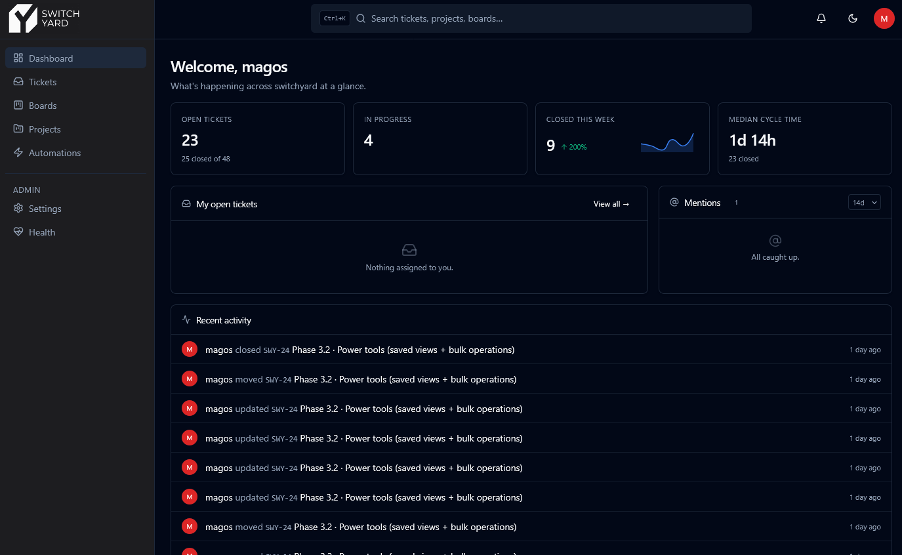
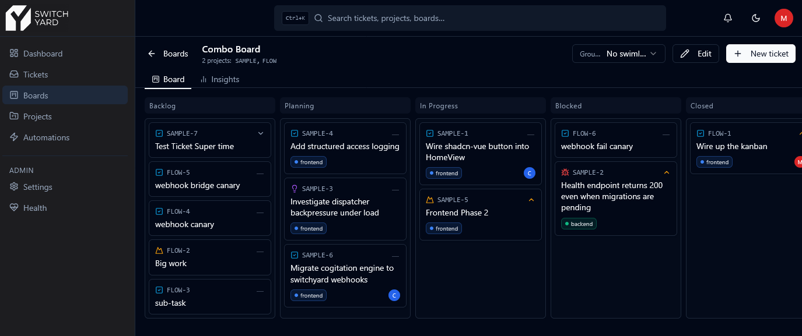
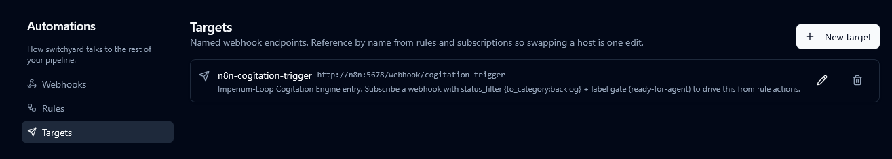
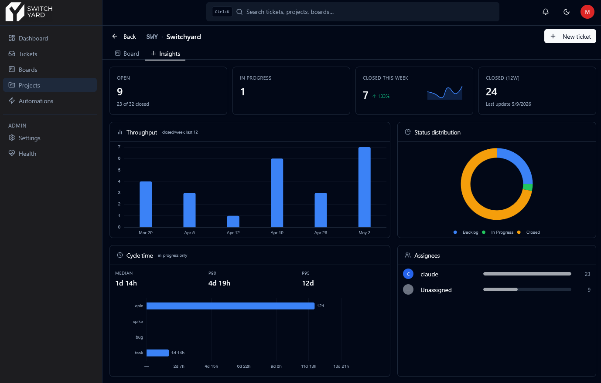
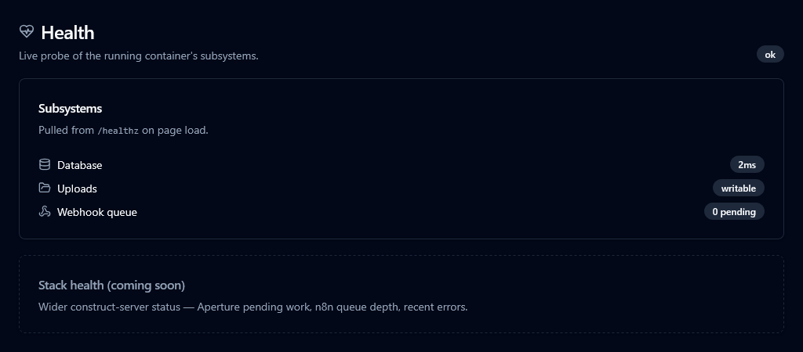

Self-hosted ticketing / project-management system. **API-first, agent-first** — every mutation the UI exposes is equally available via the REST API, making the same codebase useful to both a human clicking through a dashboard and an autonomous agent driving CI or workflow automation.

The human sees a UI. The agents see a clean, typed, idempotent HTTP API with cursor pagination, HMAC-signed webhooks, and structured error envelopes. Both are first-class citizens.



## Stack

- **Server:** Hono on Bun, Drizzle ORM, Zod schemas (single source of truth for validation + OpenAPI + shared types).
- **Client:** Vue 3 + Vite + TypeScript + Tailwind + shadcn-vue + Pinia + TanStack Query.
- **Database:** PostgreSQL 16 (shared instance on `construct_net`).
- **Deploy:** Two containers — Hono serves the API at `/v1/*`; a Bun static server handles the built Vue client and passthroughs `/v1/*` and `/healthz` to the backend.

## Features

Phases 1–4 are shipped; Phase 5 (cross-system orchestration, observability, MCP) is in progress. The headline capabilities below cover what's live today — see [`PHASES.md`](./PHASES.md) for the full timeline and architectural decisions.

### Tickets, boards, and search

Full CRUD on projects, statuses, transitions, labels, users, tokens, tickets, comments, attachments, boards, and webhooks. Virtualized ticket list with URL-driven filter state and DSL search (`project=FLOW assignee=me status=in_progress,blocked`). Saved views, multi-select bulk operations, command palette (`Ctrl+K`), keyboard shortcuts, light/dark theme.

Kanban via `pragmatic-drag-and-drop` — per-project boards, saved cross-project boards with optional swimlanes (group by project / assignee / epic / type), and an auto-seeded "All projects" default board. Closed-column drops prompt for resolution. Drag-and-drop respects each project's transitions whitelist.

Tickets support typed links (`blocks` / `relates_to` / `duplicates`), one-level epic hierarchy, due dates with overdue highlighting, cross-project move (allocates a new key, old key stays resolvable forever), and per-project custom fields that are typed views over the `metadata` JSONB.



### Automation rules

Event-triggered (`ticket.created`, `status_changed`, `commented`, …) or cron-scheduled rules. Conditions over flat JSONB (`eq` / `ne` / `in` / `contains` / `is_null` / one level of `all` | `any`). Actions cover `set_field` / `add_label` / `comment` / `assign` / `move_status` / `fire_webhook` / `call_n8n`. Per-rule rate limiting + global circuit breaker. Firings log with retry surface.

**Named targets** decouple URLs from the rules and subscriptions that reference them — rotate a host or secret with one edit instead of N. **Recurring + one-shot ticket templates** schedule periodic work ("monthly review") and lead-time reminders ("rotate tokens before 2026-08-15") under one entity, with overlap policies and a 60s scheduler tick.



### GitHub integration

`POST /v1/external/github` accepts GitHub webhooks (HMAC-verified via `GITHUB_WEBHOOK_SECRET`). On `pull_request` events the receiver parses ticket keys out of PR title + head branch name and auto-attaches the PR as an external ref on every matched ticket. State transitions (open → merged / closed) flow through live without polling. Polling (~5 min) stays active as the reconciliation backstop.

External refs surface on ticket cards (open PR / merged PR / CI pass-fail badges) and on the drawer. Combined with rules, this is how `ticket.released` happens automatically on PR merge.

### Dashboards & insights

Personal home with KPI strip (open / in-progress + stale / closed-this-week with sparkline / median cycle time), throughput chart, status-distribution donut, recent activity, @mentions, and stale-work rollups. Per-project Insights tab adds cycle time (median + P90 + P95 + per-type), assignee leaderboard, and overdue / completed-late tiles. Per-board Insights tab includes cumulative-flow chart and status-by-project breakdown.

Charts use Apache ECharts via `vue-echarts`. Theme-reactive, "no data" empty states, independent skeleton + error states so a flaky widget can't blank a dashboard.



### Agent-first API

- **Bearer token** auth (per-actor tokens with scopes); QR-code login from `/settings/tokens` to phones / tablets.
- **Idempotency keys** on every mutation (24h TTL).
- **Cursor pagination** on every list endpoint.
- **HMAC-signed webhooks** with exponential backoff, delivery log, and `POST /webhooks/deliveries/{id}/redeliver`.
- **Structured error envelopes** (`{ error: { code, message, details? } }`).
- **`X-Request-ID` headers** on every response for cross-log correlation.
- **Event sourcing** — every mutation writes to `events` and enqueues webhook deliveries in the same transaction.

Full deep-dive: [`docs/agents.md`](./docs/agents.md).

### MCP server

A hand-curated Model Context Protocol surface for Claude Desktop / Claude Code / Cline / Gemini CLI / anything that speaks MCP. **Fifteen tools** shaped for agent consumption — descriptions written for LLMs, invariants the OpenAPI schema can't express (PATCH never changes status, idempotency, `status_id` project-scoping, resolution required on close) encoded in tool docs. Request/response shapes come from the same generated `api.types.ts` as the web client so the plumbing stays in lockstep.

- **Reads** — `list_projects`, `get_project`, `get_project_statuses`, `list_labels`, `list_tickets` (multi-status via array or `open: true` shortcut), `get_ticket`, `get_ticket_comments`, `query_my_open`.
- **Writes** — `create_project` (auto-seeds the canonical 5 statuses), `create_ticket`, `update_ticket` (PATCH; `null` clears `assignee_id` / `parent_id` / `due_date`), `transition_ticket`, `transition_ticket_by_category` (sugar — skips the `get_project_statuses` round-trip), `comment_on_ticket`, `move_ticket`.

Stdio transport (Claude Desktop, Cline, Claude Code, Gemini CLI). Setup, full tool descriptions, and the in-memory test harness: [`mcp/README.md`](./mcp/README.md).

### Operations & observability

- `/healthz` deepens to a subsystem report — DB latency, uploads writability, webhook + rules queue depths.
- Structured JSON access logs with request-ID echoing.
- Graceful 10s drain on shutdown.
- Frontend container retries `503` / connection-refused on a 15s deadline during backend deploys, so most rolling restarts are invisible to users.
- `[boot]` and `[migrate]` per-phase timings in stdout — long poles are obvious in `docker logs` without external profiling.
- Migration safety guidelines codified in [`docs/migrations.md`](./docs/migrations.md).



### Testing

Server: unit + integration (Bun's test runner, transaction-rollback per test). Client: Playwright across smoke, ticket filters / saved views, bulk ops, board drag, and dashboards. Both gate every PR via GitHub Actions; HTML reports uploaded on failure.

## Layout

```
switchyard/
├── server/             Hono + Drizzle backend
├── client/             Vue 3 frontend
├── shared/             Zod schemas + derived TS types (consumed by both)
├── mcp/                Model Context Protocol server
├── docs/               Sub-page deep-dives (agents, migrations, decisions)
├── compose-changes/    Proposed diffs for ~/construct-server
├── server/Dockerfile   Backend image (API only)
├── client/Dockerfile   Frontend image (static + SPA fallback + /v1/* passthrough)
└── openapi.yaml        Generated from server route definitions
```

## Development

```bash
bun install
bun run typecheck       # tsc -b shared server client mcp (composite project)
bun run db:generate     # generate Drizzle migrations from schema changes
bun run db:migrate      # apply migrations + triggers + seed to $DATABASE_URL
bun run dev:server      # API on :4002
bun run dev:client      # Vite dev server on :5173, proxies /v1 to :4002
bun run dev:mcp         # MCP server (stdio); needs SWITCHYARD_TOKEN + SWITCHYARD_URL
bun run openapi:gen     # writes openapi.yaml from the live route registry
bun run api:gen         # also regenerates client/src/lib/api.types.ts (committed)
```

Tests:

```bash
# One-time: create the test DB (see compose-changes/README.md) then:
bun --cwd server run db:test:setup
bun --cwd server run test:unit         # pure helpers (pagination, hmac)
bun --cwd server run test:integration  # seed + webhook end-to-end (needs DATABASE_URL_TEST)
bun --cwd mcp    run test              # MCP tool surface (InMemoryTransport)

# E2E (Playwright, requires dev server running):
bun --cwd client run test:e2e
bun --cwd client run test:e2e:ui       # interactive Playwright UI
```

## Deployment notes

- Reads `DATABASE_URL` once at startup; if Postgres is unreachable, the process exits non-zero so Docker reports the failure cleanly (no silent restart-loop into a broken state).
- Watchtower is opted out via `com.centurylinklabs.watchtower.enable=false` — updates happen via deploys, not surprise restarts.
- Attachment files live in a named volume mounted at `/data/uploads`; the database stores `storage_path` only.
- Frontend container exposes port `4002` externally; backend stays internal on `construct_net`. Existing agent URLs (`http://switchyard:4002/v1/...`) continue to work unchanged.

## Further reading

- [`docs/agents.md`](./docs/agents.md) — auth, idempotency, cursor pagination, HMAC verification (Node + Python), filter syntax, GitHub webhook receiver setup.
- [`mcp/README.md`](./mcp/README.md) — MCP server setup, tool surface, wiring into Claude Desktop / Claude Code / Cline.
- [`docs/migrations.md`](./docs/migrations.md) — migration safety rules for the hot-table additive-only ladder.
- [`PHASES.md`](./PHASES.md) — full phased build plan + locked architectural decisions.
